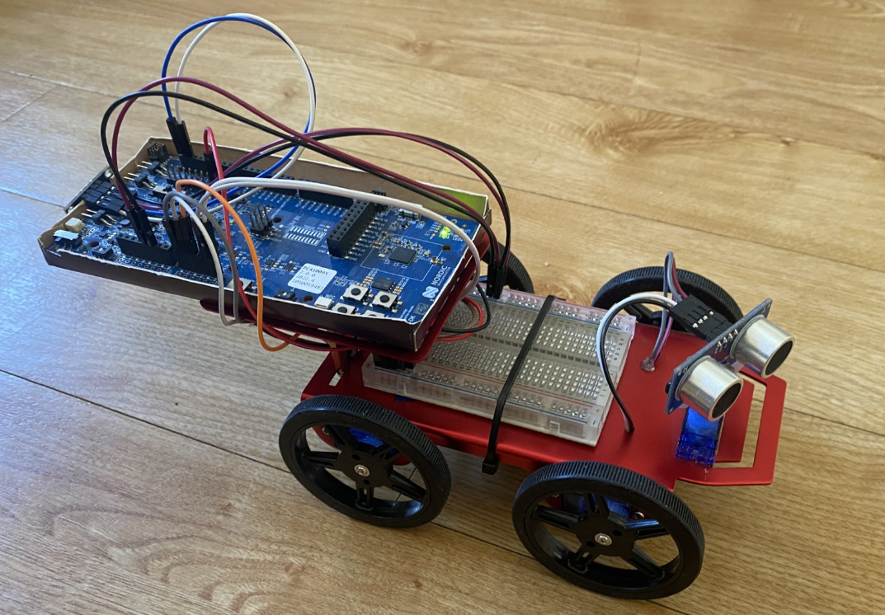
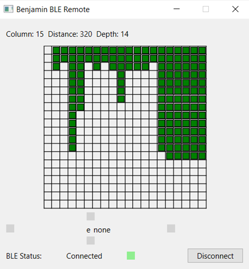

# Benjamin - BLE Vehicle

# Introduction
Application for BLE controlled vehicle with ultrasonic sensor implemented on a Nordic nRF5340-DK.

## Controller App
This repo also contains a PyQT-based BLE controller application which can be used to move the robot and shows a radar grid based on detected obstacle data from the ultrasonic sensor.

